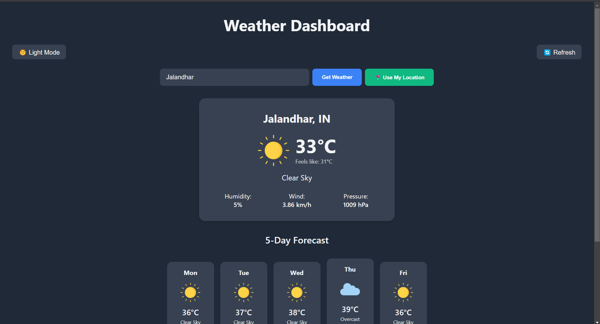

# ⛅ Weather App

A React-based weather application that fetches and displays real-time weather information using the Open Meteo API. The app includes local storage support for saving recent searches and state management using React Hooks. Users can search for any city and also use their location by granting location permission.

---

## 🚀 Tech Stack

- **Frontend:** React.js, Axios
- **State Management:** useState, useEffect
- **Local Storage:** To persist and store recent searches
- **API:** OpenWeather API for fetching weather data
- **Styling:** CSS, Flexbox/Grid

---

## 📌 Features

✅ Search for weather by city name  
✅ Displays temperature, humidity, wind speed, and weather condition  
✅ Stores recent searches using **localStorage**  
✅ Modern UI with smooth transitions  
✅ User location for accurate data and result  
✅ Error handling for invalid cities or when data is not available 

---

## Setting Up the Frontend

```bash
# Navigate to frontend directory
cd directory

# Install dependencies
npm install

# Start the frontend development server
npm start
# The application should now be running on http://localhost:3000


```
---

## State Management & Local Storage  

### useState:  
- Used to manage the state of the **search input, weather data, recent searches and theme**.  

#### Example states:  
- `data` → Stores the fetched weather details.  
- `city` → Holds the user input for city name.  
- `history` → Stores previously searched cities.  
- `theme` → Stores the theme dark or light mode.  

---

### useEffect:  
- Used to **fetch weather data** when a city is searched or any change in city.  
- Used to **load recent searches from localStorage** when the page is reloaded or visited again.  
- Triggers updates when `city` or `history` updates.  

---

### Local Storage:  
- Saves **recently searched cities** so they persist after page reload upto 5 of them.  
- **Retrieves saved searches** when the website is reopened.  

#### Example usage:  
javascript
localStorage.setItem("cities", JSON.stringify(updatedHistory));

const [history, setHistory] = useState(() => JSON.parse(localStorage.getItem("cities")) || []);
-----
Live Link:https://zynetic-weather.vercel.app/
### Home

### History

